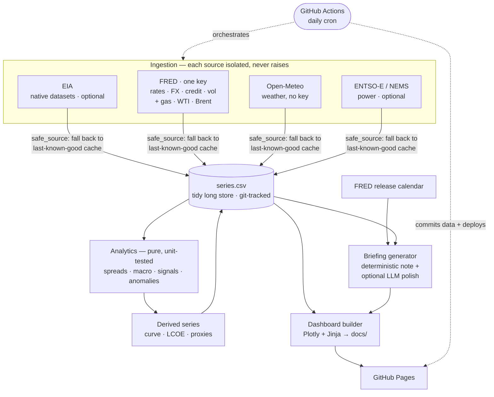

# Merit Order

**A fully-autonomous macro & energy-market intelligence platform.** Every day, with no human in the loop, it ingests public rates, FX, credit, equity-vol, power, gas, oil and weather data, computes the cross-asset and energy analytics a real trading desk watches — the Treasury curve and risk regime, clean spark/dark spreads, fuel-switching economics, and the macro-to-energy bridges that tie them together — explains every figure in plain English, auto-writes a trading-desk-style morning briefing, publishes a live dashboard to GitHub Pages, and emails the digest to your inbox each morning.

> **Live dashboard:** `https://<your-username>.github.io/merit-order/`
> **Status:**  

---

## Why this exists

Energy is the market that sits at the exact seam between the physical world and the financial one: a weather front becomes a demand spike becomes a move in the marginal plant becomes a move in the spark spread becomes a P&L. But that energy chain doesn't run in isolation — it runs *inside* a macro regime. Real yields set the cost of capital for every renewable project and PPA; the dollar pushes the entire commodity complex; credit spreads and equity vol set the risk appetite that commodities trade with. A trader who can only see one half is flying blind.

So Merit Order carries **both books at once** — a macro cross-asset layer and an energy layer — and, more importantly, builds the **bridges between them**. It's built to two standards:

- **Desk-grade analytics.** The quantities here — the yield curve and a transparent risk-regime score, spark/dark spreads, fuel-switching breakevens, and a real-yield-to-LCOE transmission — are the ones a macro-aware power/gas trader or a transition-finance analyst actually reasons about, computed from first principles with every assumption labelled.
- **Production-grade reliability.** No external feed can break the daily run. Every source degrades to last-known-good, the maths is unit-tested, and the site always publishes — even on a day when every upstream API is down.

The honesty about *what is measured vs assumed* is itself the point: a free, public-data platform that pretended it had live TTF, EUA or fed-funds-futures prices would be lying. The credible version says exactly where the clean data ends and the modelling assumptions begin.

---

## What it computes

**Macro & cross-asset**

| Quantity | What it tells you | How it's computed |
|---|---|---|
| **Treasury curve & 2s10s slope** | Growth/recession signal; inversion flag | constant-maturity yields; `(10y − 2y) × 100` bps |
| **10y real yield & breakeven** | The true cost of capital and priced inflation | TIPS yield (DFII10) and breakeven (T10YIE) |
| **Risk-regime score** | Risk-on / risk-off, as a transparent tally | rules-based votes from VIX, HY-spread z-score, the dollar, curve change |
| **Dollar ↔ crude correlation** | The textbook inverse USD–commodity link, quantified | rolling correlation of daily changes, date-aligned |
| **Real-yield → renewable LCOE** | How macro rates move transition economics | discount rate = real yield + WACC premium → LCOE via the capital-recovery factor |

**Energy**

| Quantity | What it tells you | How it's computed |
|---|---|---|
| **CCGT breakeven (gas SRMC)** | A gas plant's place in the merit order | `gas × heat_rate + carbon × emissions_factor` |
| **Clean spark / dark spread** | Gas- / coal-plant generation margin | `power − fuel×HR − carbon×EF` *(live once a power feed is wired)* |
| **Fuel-switching carbon price** | Where gas overtakes coal in the stack | `(gas·HR_g − coal·HR_c) / (EF_c − EF_g)` |
| **HDD / CDD + wind/solar proxies** | Demand pressure and renewable supply | degree-days; cubic wind-power curve; irradiance-normalised solar |
| **Rolling z-score anomaly flags** | What broke its own 90-day range today | `(x − μ₉₀) / σ₉₀`, flagged at \|z\| > 2 |

The standout is the **real-yield → LCOE bridge**: it takes a live macro input and runs it through the exact project-finance algebra (capital-recovery factor → levelised cost) to show, in one number, how a 100bp move in real yields reprices a renewable build. That is the macro-to-transition-finance transmission a low-carbon IB or commodities desk cares about — and it's computable today from free data.

---

## Architecture



**Five layers, each independently testable:**

1. **Ingestion** (`ingest/`) — one module per source, each wrapped in a `@safe_source` decorator that catches everything, retries with backoff, and on failure returns the last good cached value instead of raising. A source going dark is a normal, handled event.
2. **Store** (`store.py`) — a single tidy long CSV committed by the Action each run. No server DB to provision or keep alive; every change is a readable git diff; the full history is browsable in the repo. Upserts are idempotent on `(date, series)`.
3. **Analytics** (`analytics/`) — pure, NaN-safe functions with no network or state: `spreads.py` (energy), `macro.py` (rates, regime, the LCOE bridge), `signals.py` (weather proxies, z-scores, cross-asset correlation). This is the unit-tested core.
4. **Briefing** (`briefing/`) — a deterministic Jinja note that *always* ships, plus an **optional** LLM polish pass (Anthropic) that only restyles prose and is structurally forbidden from inventing numbers.
5. **Dashboard** (`dashboard/`) — Plotly charts and a hand-built "desk terminal" layout with separate macro and energy tapes, rendered to `docs/` for GitHub Pages.

Orchestration is a single `pipeline.py` run nightly by GitHub Actions, which then commits the refreshed data and deploys the rebuilt site.

---

## Data sources — what's real, what's a proxy

The single most important table in this repo. I refuse to fake a live feed I don't have.

| Source | Coverage | Cost | Reliability | Notes |
|---|---|---|---|---|
| **FRED** | The Treasury curve, real yields, breakevens, the dollar & FX majors, IG/HY credit spreads, VIX, equity indices, policy rates, **plus the daily gas/WTI/Brent benchmarks** (EIA's own series, served via FRED), and the release calendar | Free **with one key** | Rock-solid | The whole backbone — macro *and* energy on a single key |
| **Open-Meteo** | Temperature, 100 m wind, irradiance at any point | Free, **no key** | Rock-solid | Drives HDD/CDD and the renewable-output proxies |
| **EIA (native)** | Storage, production, generation mix, EIA-native series | Free **with key** | Rock-solid | Optional — FRED already covers gas/oil; enable for EIA-specific datasets |
| **ENTSO-E / Singapore NEMS** | European / Singapore power, load, prices | Free **w/ token** | Good | Optional module → unlocks a *live* spark spread (your edge) |
| **TTF / JKM gas, EUA carbon; fed-funds futures** | EU/Asian gas, EU carbon, market-implied policy path | ❌ no clean free feed | — | Treated as **clearly-labelled assumptions / proxies**; the pipeline degrades gracefully rather than pretending |

FRED is to macro what EIA is to energy: where free data exists, it's genuinely good; where it doesn't (live European gas, carbon, intraday, the implied rate path) the platform is explicit about the gap and proxies it transparently — e.g. it reads the front-end of the curve as a policy-expectations proxy rather than inventing a futures feed.

---

## Reliability — why it won't break daily

- **No source can crash the run.** `@safe_source` guarantees every ingestion returns a result object, never an exception; failures fall back to cache and are reported, not fatal.
- **Graceful degradation, proven.** On a full-blackout day (every external API down) the pipeline still completes, reuses the last good data, and publishes a valid dashboard that honestly marks each series' freshness. The macro calendar simply omits itself if its endpoint is unreachable.
- **Idempotent writes** — re-running a day overwrites in place on `(date, series)`.
- **The maths is tested.** `pytest` runs on every push; the clean-spark-spread and the capital-recovery/LCOE worked examples are asserted to the cent.
- **Pinned dependencies + timeouts** on every job.
- **Secrets via GitHub Actions secrets only** — never committed, never echoed. Missing keys disable a source cleanly instead of erroring.

---

## Tech stack

Python 3.12 · pandas · Jinja2 · Plotly · `requests` · pytest · GitHub Actions · GitHub Pages. Optional: `anthropic` (briefing polish), `entsoe-py` (European power). Deliberately dependency-light so the daily job is fast and there's little to break.

---

## Repo structure

```
merit-order/
├── config.py               # all tunables: toggles, keys-from-env, series catalogues, assumptions
├── pipeline.py             # daily orchestrator (ingest → store → derive → briefing → site)
├── seed_demo.py            # optional: seed plausible history to preview the site without keys
├── setup/bootstrap.sh      # one command: create repo, set secrets, enable Pages, trigger run
├── .env.example            # local key template (copied to .env, git-ignored)
├── SETUP.md                # exact go-live runbook + manual alternative + troubleshooting
├── ingest/
│   ├── base.py             # safe_source decorator, retry/backoff, cache, tidy schema
│   ├── eia.py              # Henry Hub / WTI / Brent
│   ├── fred.py             # macro: rates, FX, credit, vol, equities + release calendar
│   ├── open_meteo.py       # weather → daily HDD/CDD/wind/irradiance per point
│   ├── entsoe.py           # European power (optional)
│   └── singapore.py        # NEMS module (optional edge)
├── analytics/
│   ├── spreads.py          # energy: SRMC, clean spark/dark spreads, fuel-switching price
│   ├── macro.py            # macro: curve slope, risk regime, capital-recovery factor, LCOE bridge
│   └── signals.py          # HDD/CDD, wind/solar proxies, z-scores, cross-asset correlation
├── store.py                # tidy-CSV historical store, idempotent upsert
├── briefing/               # deterministic note + optional LLM polish, desk-note template
├── dashboard/              # Plotly charts + macro/energy tapes → docs/
├── data/                   # series.csv (accumulating), _freshness.json, _calendar.json
├── docs/                   # GitHub Pages output (index.html + briefing.md)
├── tests/                  # pytest — energy + macro analytics provably correct
└── .github/workflows/      # daily.yml (cron) + tests.yml (CI)
```

---

## Run it yourself

**Preview locally in 30 seconds, no keys:**

```bash
pip install -r requirements.txt
python seed_demo.py          # ~90 business days of plausible macro + energy history
python pipeline.py           # builds docs/index.html
open docs/index.html
```

**Go live as a real, self-updating site — one free key, one command:**

```bash
cp .env.example .env         # paste your free FRED key into .env
bash setup/bootstrap.sh      # creates the repo, sets encrypted secrets, enables Pages, triggers the first run
```

The product runs on a **single free key (FRED)** — it covers the macro data *and* the gas/oil benchmarks. Full step-by-step instructions, the manual alternative, and troubleshooting are in **[SETUP.md](SETUP.md)**. Keys live only in GitHub's encrypted Actions secrets, never in the repo.

---

## Roadmap

- [x] **Stage 0** — repo + Actions skeleton that publishes on a schedule
- [x] **Stage 1** — FRED (macro + gas/oil on one key) + Open-Meteo backbone with caching and graceful degradation
- [x] **Stage 2** — analytics: energy spreads, macro curve/regime, the real-yield→LCOE bridge, cross-asset correlation, anomalies (unit-tested)
- [x] **Stage 3** — auto-written macro + energy briefing with an economic-release calendar (deterministic + optional LLM polish)
- [x] **Stage 4** — "desk terminal" dashboard with macro and energy tapes
- [ ] **Stage 5** — region power module: ENTSO-E *or* Singapore NEMS → a **live** spark spread (the differentiator)
- [ ] **Stage 6** — signature studies on the accumulated history: a renewable **cannibalisation tracker**, a **Dunkelflaute detector**, a **fuel-switch monitor**, and a macro **regime-vs-commodity-beta** study, plus a methodology page

---

## Methodology & honesty notes

Assumptions (coal price, carbon price, the stylised LCOE parameters, the WACC premium over real yields) live in `config.py`, are surfaced on the dashboard, and are trivially swapped for real series. The risk-regime score is a transparent rules-based tally, not a black box. Heat rates follow the US convention (MMBtu/MWh); the European MWh-thermal convention is documented alongside. Renewable and weather proxies are *modelled* signals, clearly labelled as such. Where no free feed exists (live EU gas/carbon, the market-implied rate path) the platform proxies transparently rather than fabricating data. **This is an analytical and engineering portfolio project, not investment advice.**
